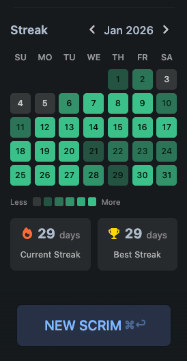
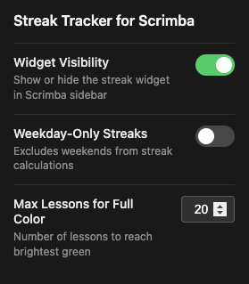

#  Streak Tracker for Scrimba

A browser extension that adds a GitHub-style contribution graph to your Scrimba side navbar, helping you track your learning streaks and stay motivated.



## Features

- **GitHub-style Activity Calendar** - Visual month view showing your lesson completion activity with color-coded intensity levels
- **Streak Tracking** - Displays your current streak and best streak to keep you motivated
- **Real-time Updates** - Automatically detects when you complete lessons
- **Month Navigation** - Browse through your learning history month by month
- **Accessible** - Full keyboard navigation and screen reader support

## Extension Settings

Click the extension icon to access the settings popup.



| Setting                        | Default | Description                                                                                 |
| ------------------------------ | ------- | ------------------------------------------------------------------------------------------- |
| **Show Widget**                | On      | Toggle the visibility of the streak tracker widget in the Scrimba sidebar                   |
| **Weekday-Only Streaks**       | Off     | When enabled, streaks only count weekdays (Mon-Fri), so weekends won't break your streak    |
| **Max Lessons for Full Color** | 10      | Number of lessons needed in a single day to reach the brightest green color on the calendar |

## Installation

### Chrome

1. Download or clone this repository (if downloading as ZIP, extract the folder first)
2. Open Chrome and navigate to `chrome://extensions/`
3. Enable **Developer mode** (toggle in the top right)
4. Click **Load unpacked**
5. Select the extension folder
6. Visit [scrimba.com](https://scrimba.com) to see the widget in action

### Firefox

1. Download or clone this repository (if downloading as ZIP, extract the folder first)
2. **Modify `manifest.json`** - Replace the background section:

   Change this:

   ```json
   "background": {
     "service_worker": "background/service-worker.js",
     "scripts": ["background/service-worker.js"]
   }
   ```

   To this:

   ```json
   "background": {
     "scripts": ["background/service-worker.js"]
   }
   ```

3. Open Firefox and navigate to `about:debugging#/runtime/this-firefox`
4. Click **Load Temporary Add-on**
5. Select the `manifest.json` file from the extension folder
6. Visit [scrimba.com](https://scrimba.com) to see the widget in action

> **Note:** Temporary add-ons in Firefox are removed when you close the browser. For permanent installation, the extension would need to be signed and published on [addons.mozilla.org](https://addons.mozilla.org).

## How It Works

The extension reads your completed lesson data from Scrimba and displays it in a visual calendar format. Activity levels are color-coded from light to dark green based on how many lessons you completed each day:

- **Level 0** - No activity (gray)
- **Level 1-4** - Increasing shades of green
- **Level 5** - Maximum activity (brightest green)

The thresholds for each level scale based on your "Max Lessons for Full Color" setting.

## Privacy

This extension:

- Only runs on scrimba.com
- Stores settings locally using browser storage sync
- Does not collect or transmit any personal data
- Does not require any external API calls

## License

MIT License
